**Artificial Intelligence Course**
Markov Decision Processes
**5th January 2021**

# **OVERVIEW**
Consider the 3x3 world shown in the following figure:

The agent has four actions Up, Down, Right and Left. The transition model is: 80% of the time the agent goes in the direction it selects; the rest of the time it moves at right angles to the intended direction. A collision with a wall results in no movement.
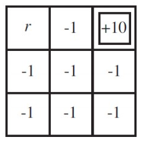
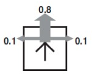

# **Data Structure used**
We implement a MDP class which contains 

- States S
- Actions A
- Transitions P(s’|s,a) (or T(s,a,s’))
- Rewards R(s,a,s’) (and discount γ)
- Start state s0
- Policy

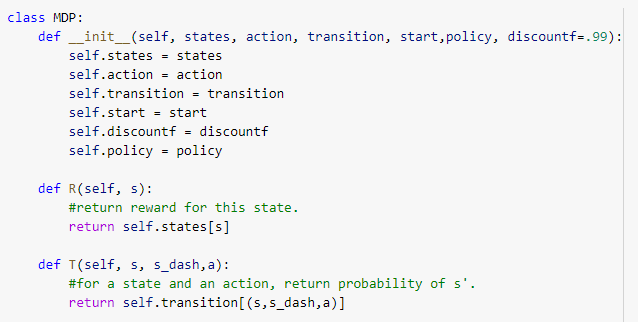

**Transitions** are a Dictionary, its key is a tuple consisting of (s, s’, a) and the value is the probability of that transition.
**Actions** are 1→ Up, -1 → Down, 2→ right, -2 → Left
**States** are 1d array containing reward value for each state.

**The grid for us is like** 

State number

|1|2|3|
| :-: | :-: | :-: |
|4|5|6|
|7|8|9|

Reward values where r is [-3, 0, 3, 100]

|r|-1|10|
| :-: | :-: | :-: |
|-1|-1|-1|
|-1|-1|-1|

# **Value Iteration**
## **Algorithm**
## 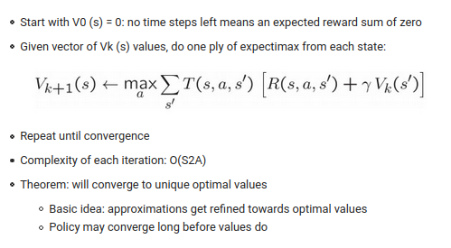
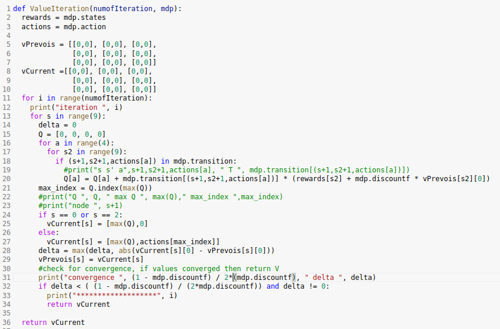
## **Result Policy**
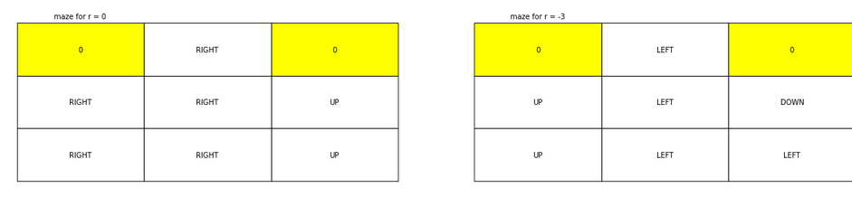
### 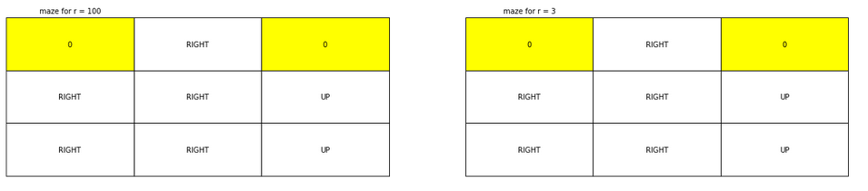

# **Policy Iteration**
## **Algorithm**
- The idea is

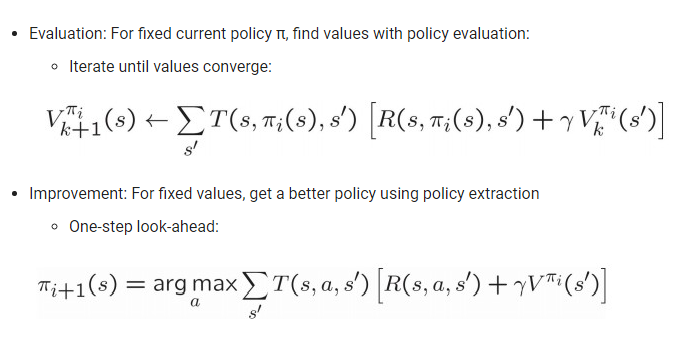

- The code consists of two parts
- first one is the function of policy iteration which takes a MDP class and the number of iterations and returns the new policy that algorithm found.

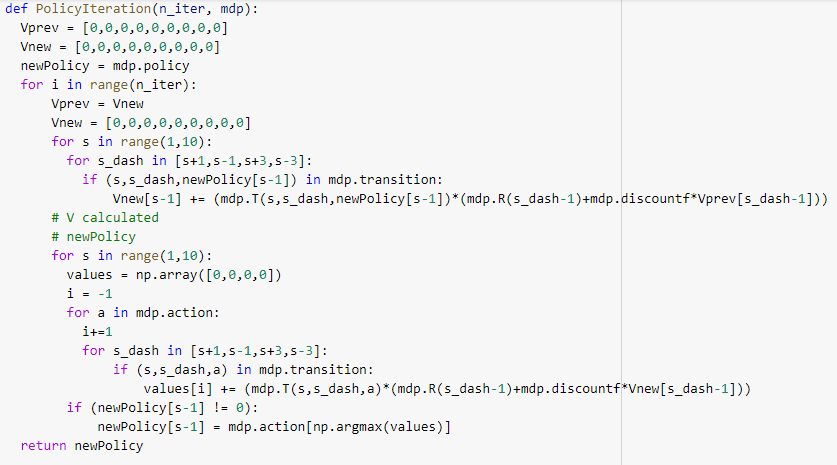

- Second part is the code which runs this algorithm 4 times for each r value and print path from start point by the obtained policy.

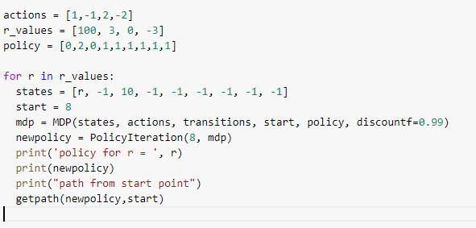

## **Result Policy Without Early Stopping**
### 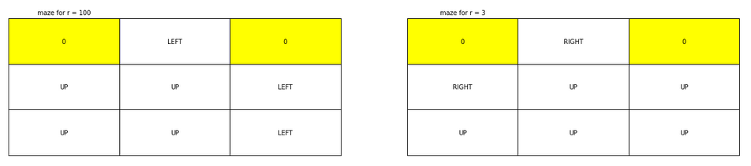
### 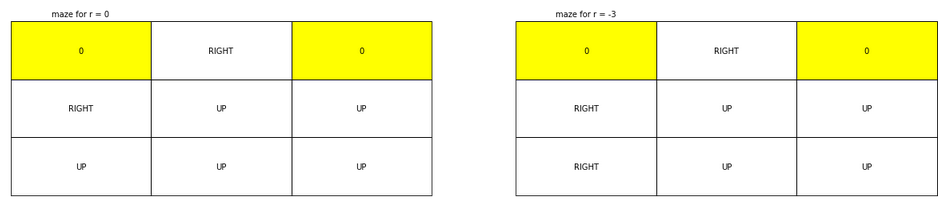

## **Result Policy With Early Stopping**
For r = 100 at iteration 3
For r = 3 at iteration 3
For r = 0 at iteration 2
For r = -3 at iteration 3
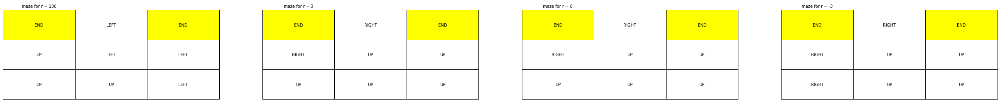
